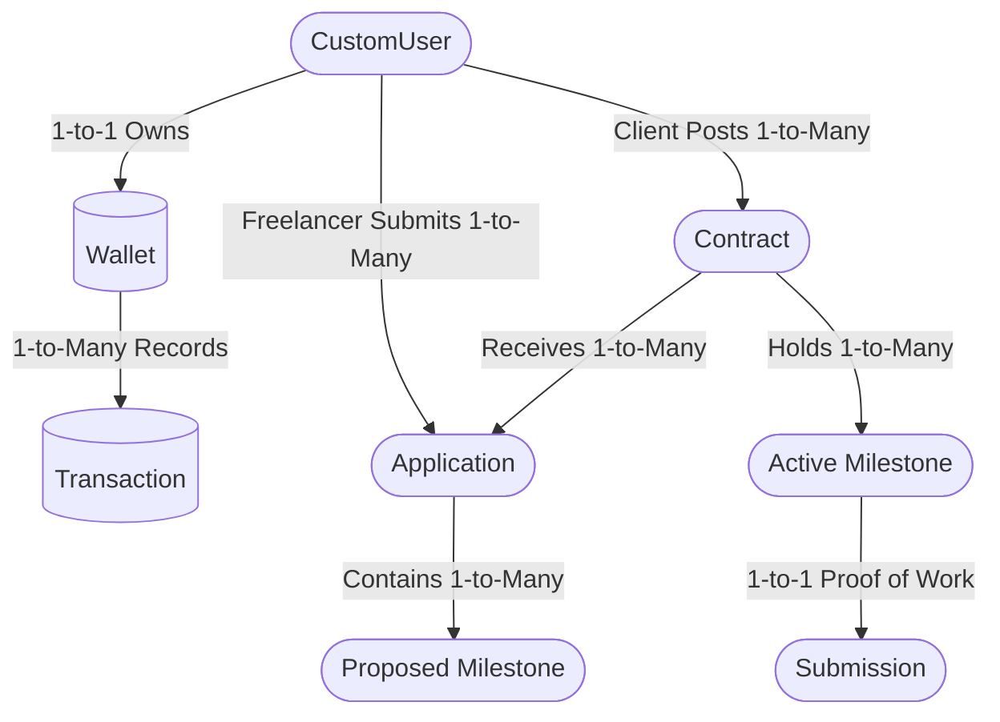

---

# SecureWork - Enterprise B2B Freelance Marketplace & Escrow Engine 🚀

SecureWork is a production-ready freelance marketplace designed to solve the single biggest bottleneck in the gig economy: **Trust**.
SecureWork replaces insecure paper contracts with a cryptographic **Escrow Vault**. Clients deposit and lock funds safely before work begins, giving freelancers a 100% guarantee that the capital exists and is waiting for them upon approval.

By engineering a decoupled architecture with a focus on atomic transactions and Role-Based Access Control (RBAC), I built a platform that brings enterprise-level security and dynamic analytics to the freelancing workflow.

🔗 **Live Demo:** [https://secure-work.vercel.app/](https://secure-work.vercel.app/)

---

## 🔒 The Core Security Mechanism (How it Works)

1. **Contract Initialization**: A Client posts a job post. A Freelancer finds the job and submits an Application, proposing a specific list of milestones.
2. **Hiring**: When the Client clicks 'Accept Proposal', the backend generates a `Milestone` model in a `pending` state.
3. **Capital Injection**: Before the freelancer writes a single line of code, the client is required to click **'Fund Escrow'**. This is the key security event.
4. **Database Protection (`services.py`)**: To prevent race conditions or double-spending, the `fund_milestone` method in the Django backend actively locks the specific Wallet database row using **`select_for_update()`**. It then performs a transaction using Django's **`transaction.atomic()`** block:
* It checks the client has sufficient liquid balance.
* It debits the Client's liquid balance.
* It credits the **Escrow Vault** for that specific contract.
* It generates an immutable **'escrow_lock'** transaction record in the ledger.
* It updates the Milestone status to `funded`.
* *If any line of code fails during this entire sequence, the entire transaction is rolled back. Money can never be created or destroyed by a system error.*


5. **Payment Guarantee**: The freelancer can now safely begin work, knowing the funds are locked by the system and are waiting for them.
6. **Submission & Approval**: The freelancer submits their work (`Submission` model). The client reviews it.
7. **Auto-Resolution**: Once the Client clicks 'Release Funds', the system executes another atomic transaction, moving the capital from the Escrow Vault into the Freelancer's available balance and automatically updating the parent contract status to `completed` if all milestones are finalized.

This process eliminates the fear of non-payment for creators and ensures clients only pay for deliverables they actively approve.

---

## 🌟 Key Features

### ✨ System-Wide (Core Platform)

* 🛡️ **ACID Compliant Financial Logic**: All money handling logic is decoupled from views into `services.py`, leveraging `transaction.atomic()` and `select_for_update()` for 100% data integrity and zero race conditions.
* 🛡️ **Robust Authentication (SimpleJWT)**: Secured stateless API authentication using JSON Web Tokens.
* 🛡️ **Role-Based Access Control (RBAC)**: Strict separation of privileges between Clients and Freelancers via a custom database field; the API actively rejects unauthorized role actions.
* ⚡ **Zero-Latency Data Filtering**: Caches job board data and performs advanced search/budget filtering in the browser memory using Vanilla JS for instant visual feedback.
* 📊 **Dynamic Analytics (Chart.js)**: Line and breakdown doughnut charts render dynamic trajectory data directly from backend REST API stats. New: upgraded glassmorphic tooltips.

### 👩‍💻 For Freelancers

* 🌐 **Premium Portfolio Management**: A dedicated UI on the settings page to showcase GitHub links, portfolio URLs, professional titles, and tech stack skills.
* 📄 **Dynamic Bidding System**: Create proposals with a dynamically generated array of milestones, including custom titles, amounts, and due dates.
* 💸 **Dynamic Escrow Breakdown**: The Freelancer Wallet dynamically aggregates and displays the sum of all 'funded' and 'submitted' milestones from different clients, providing a clear picture of incoming revenue.
* deliver **Deliverable Submissions**: Link proof-of-work (GitHub/Drive links, future: file attachments) to specific milestones for client review.

### 🏢 For Clients

* 🏗️ **Infrastructure Deployment**: Post detailed contracts with total budget allocations and project scopes.
* approved **Deliverable Review & Approval**: Review submitted proof-of-work and execute automated fund release with a single click.
* actions **Action-Required Hub**: The main client dashboard actively lists contracts that require funding or approval, ensuring zero project bottlenecks.
* card **Billing & Financial Management**: Link corporate payment methods and track all platform expenditures via the immutable ledger.

---

## 🗺️ System & User Journey Workflow

This flowchart illustrates the successful "Happy Path" lifecycle of a contract, highlighting how the platform acts as the secure bridge between both actors.


---

## 🏗️ Technical Architecture & Decoupled Design

SecureWork is engineered as a strictly decoupled architecture, isolating the Presentation layer from the Business Logic layer.

**The Backend (REST API)**:
Powered by **Python/Django**, this is the central brain. It handles JWT authentication, performs complex financial accounting via atomic services, enforces Role-Based Access Control, and provides data statistics via REST endpoints.

**The Frontend (JavaScript)**:
Built with **HTML, Vanilla JavaScript, and Tailwind CSS**. The entire UI communicates with the backend exclusively through asynchronous API calls via the central `app.js` controller. A custom DOM Notification Engine provides glassmorphic toast alerts for all system interactions, replacing standard browser alerts for a premium user experience.

### Database Schema (ER Flowchart)

This is a connected, architectural flowchart showing how the backend data models interact. It focuses on relationships rather than field types.



---

## 📂 File Structure Diagram

The project separates frontend assets from the Django application logic.

```text
/PROJECT_ROOT
│
├── manage.py                  # Django administrative script
├── secrets.json.example       # Example file for JWT keys/database configuration
│
├── /securework_api            # Project configuration folder
│   ├── settings.py
│   ├── urls.py
│   ├── wsgi.py
│   └── simple_jwt.py         # Custom SimpleJWT settings
│
├── /core                      # Core application app (Authentication, Wallets, Admin)
│   ├── models.py              # User, Wallet, Transaction definitions
│   ├── serializers.py        # Token serializers
│   └── views.py              # JWT views, custom stats endpoints
│
├── /contracts                 # Contracts app (Job board, Escrow logic, Milestones)
│   ├── models.py              # Contract, Application, Milestone definitions
│   ├── serializers.py        # Application with nested milestone creation
│   ├── views.py              # Milestone/application views with RBAC checks
│   ├── urls.py
│   └── services.py           # The "Secret Sauce": atomic FinanceService logic
│
└── /frontend                  # Decoupled Presentation Layer (Served as static files)
    ├── /js                    # JavaScript logic folder
    │   ├── app.js             # Central controller for all API interactions & Toast Engine
    │   ├── auth.js            # Handles token storage & authentication state
    │   ├── dashboard.js       # Chart.js initialization and stats loading
    │   ├── wallet.js          # Wallet balance and ledger loading logic
    │   └── contract-detail.js # Custom timeline UI logic
    │
    ├── /css
    │   └── styles.css         # Minimal custom CSS rules
    │
    ├── index.html             # Premium landing page
    ├── dashboard.html         # User command center template
    ├── register.html          # Role-selection based registration
    ├── contracts.html         # The job board with live JS filtering
    ├── contract-detail.html   # Command center template
    ├── wallet.html            # Hub for balances and transactions
    └── settings.html          # Role-Based tabbed settings

```

---

## 🛠️ Installation & Setup (Local Deployment)

This is a developer-centric guide for spinning up the complete full-stack infrastructure locally.

### Prerequisites

* Python 3.8+
* PostgreSQL (Highly Recommended, required for full ACID/Row locking testing)
* A basic local static file server (e.g., Python `http.server`, or just open the HTML files directly for testing).

### 1. Backend Setup (Django API)

**a. Clone the repository**:

```bash
git clone https://github.com/Savant261/SecureWork.git
cd SecureWork

```

**b. Configure Secrets**:

* Rename `secrets.json.example` to `secrets.json`.
* Generate a `SECRET_KEY` and populate the `SIMPLE_JWT` configuration with appropriate signing keys (e.g., RS256 private/public key pair). Populate database credentials.

**c. Build & Run the Environment**:

```bash
python3 -m venv venv
source venv/bin/activate
pip install -r requirements.py
python manage.py makemigrations
python manage.py migrate
python manage.py runserver

```

The Django REST API will be accessible at `http://127.0.0.1:8000/api`.

### 2. Frontend Setup (Vanilla HTML/JS)

**a. Serve the frontend folder**:

* By default, `app.js` points to `http://127.0.0.1:8000/api`.
* Navigate to the `/frontend` directory. If you are using Python, you can run a simple server:

```bash
cd frontend
python3 -m http.server 3000

```

Open your browser to `http://127.0.0.1:3000` to access the premium SecureWork interface.

---

## 🛠️ Future Roadmap

SecureWork is designed to scale. The next phases of development are focused on production hardening:

1. **Arbiter Role & Dispute Resolution**: Introduce a third 'Arbiter' (superuser) role. In the event of a dispute, this role can pause the contract, review submission records, and force-release funds based on arbitration.
2. **File Attachments for Submissions**: Currently, freelancers submit URLs. I intend to upgrade the `Submission` model to handle actual `FileField` uploads for PDFs and source code zips.
3. **Real Profile Pictures**: Linking the `settings.html` dropzone to a backend `ImageField` on the `CustomUser` model.
4. **Contract-Specific Messaging Thread**: A real-time (WebSocket) or chronological chronological chronological chronological comment thread on the contract detail page between client and freelancer.

---

## 📄 License

This project is licensed under the MIT License - see the `LICENSE` file for details.

## 👥 Authors

* **Savant Kumar Jena** - *Initial Work & Architectural Design* - 3rd Year CSE,.

### **Acknowledgments**

This project was built to explore advanced software architecture principles, the Django transactional model, and the decoupling of modern web applications. Thank you to the Django and Tailwind communities for the incredible tools and documentation!
